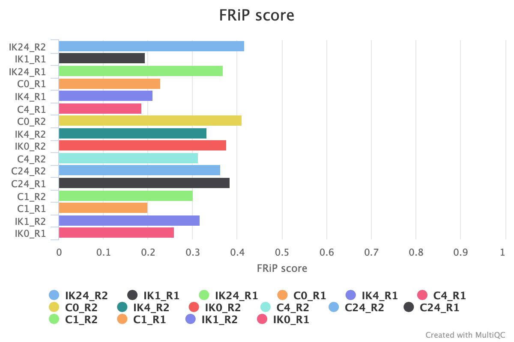

```{r, include = FALSE, dev='svglite'}
library(dplyr)
knitr::opts_chunk$set(
  echo=FALSE,
  message=FALSE,
  warnings=FALSE,
  dev='svglite'
)
```

This is an intermediate report for the analysis of project #5986. It includes the preprocessing, quality control and downstream analysis (i.e. differential expression and pathway enrichment analysis). More raw data is available but not yet included in this report.

# Data Description

The experiment consist of 2 patient-derived cell lines; each either knocked down for IRAK3 or control and followed during 4 timepoints: 0, 1, 4 and 24 hours. So, a total of 16 samples to be analyzed:

```{r tab, results='asis'}
tab <- "
| Name | Treatment | Time | Donor |
|------|:-----------:|:------:|:-----:|
| C0_R1 | Control | 0 | 5 |
| C0_R2 | Control | 0 | 6 |
| C1_R1 | Control | 1 | 5 |
| C1_R2 | Control | 1 | 6 |
| C4_R1 | Control | 4 | 5 |
| C4_R2 | Control | 4 | 6 |
| C24_R1 | Control | 24 | 5 |
| C24_R2 | Control | 24 | 6 |
| IK0_R1 | Knockdown | 0 | 5 |
| IK0_R2 | Knockdown | 0 | 6 |
| IK1_R1 | Knockdown | 1 | 5 |
| IK1_R2 | Knockdown | 1 | 6 |
| IK4_R1 | Knockdown | 4 | 5 |
| IK4_R2 | Knockdown | 4 | 6 |
| IK24_R1 | Knockdown | 24 | 5 |
| IK24_R2 | Knockdown | 24 | 6 |
"
cat(tab)
```

The donors will serve as replicates to allow for a statistical analysis. The biggest interest is comparing the knockdown of IRAK3 versus the control for each time point. Also of interest is the time-dependent chromatin accesibility in the control cells after stimulation, so comparing C1, C4 and C24 versus C0.

# Contract

A contract was set up with the following deliverables:

* Raw data transfer to Bianca project
* Run best practice preprocessing pipeline
* Pre- and post alignment quality control
* Peak calling
* Differential peak analysis + annotation
* Pathway enrichment
* Report with all results, tables and analysis code

# Preprocessing

The data is delivered as standard fastq files containing the raw, unmapped read data. The data preprocessing was done by running the nf-core atacseq pipeline. Briefly, the following steps were performed:

1. Raw read QC
2. Adapter trimming
3. Alignment (BWA)
4. Mark duplicates
5. Merge alignments from multiple libraries of the same sample
    + Re-mark duplicates
    + Filtering to remove:
        * reads mapping to mitochondrial DNA
        * reads mapping to blacklisted regions
        * reads that are marked as duplicates
        * reads that arent marked as primary alignments
        * reads that are unmapped
        * reads that map to multiple locations
        * reads containing > 4 mismatches
        * reads that are soft-clipped
        * reads that have an insert size > 2kb
        * reads that map to different chromosomes
        * reads that arent in FR orientation
        * reads where only one read of the pair fails the above criteria
    + Alignment-level QC and estimation of library complexity
    + Create normalised bigWig files scaled to 1 million mapped reads
    + Generate gene-body meta-profile from bigWig files
    + Calculate genome-wide enrichment
    + Call broad peaks (MACS2)
    + Annotate peaks relative to gene features
    + Create consensus peakset across all samples and create tabular file to aid in the filtering of the data
    + Count reads in consensus peaks (featureCounts)
    + Differential accessibility analysis, PCA and clustering
    + Generate ATAC-seq specific QC html report
6. Create IGV session file containing bigWig tracks, peaks and differential sites for data visualisation (IGV).
7. Present QC for raw read, alignment, peak-calling and differential accessibility results (ataqv, MultiQC, R)


# Quality Control

Two very useful quality control softwares were run on the data: multiQC and ataqv. These contain many high-quality plots; most of them are interactive and with relevant help sections to help interpretation. Most figures can be filtered and downloaded as needed. If the figures are too small to see, please right-click and "Open Frame in New Tab"

## MultiQC

MultiQC is a reporting tool that parses summary statistics from results and log files generated by other bioinformatics tools. The LIB sections are done for each library separately - so for each technical replicate and each forward and reverse read collection (64 samples in total). MERGED LIB are for the 16 biological samples (so, technical replicates merged and looking at fragments after mapping the forward and reverse read pairs). The QC tools summarized here are:

- FastQC: raw quality measures on base and read level (before and after trimming adapters)
- Cutadapt: QC of trimming step
- SAMTools: mapping statistics
- Preseq: library complexity
- Picard: diverse statistics (of special interest here is the Insert size)
- DeepTools: fingerprint plot and read distribution profile
- MACS2: peak count and frip score
- HOMER: peak annotation proportion
- featureCounts: proportion of reads assigned to known genetic features
- DESEeq2: PCA and sample similarity


```{r, out.width="100%"}
knitr::include_url("results/multiqc/broadPeak/multiqc_report.html", height = "800px")
```


## ataqv

ataqv makes some ATAC specific quality plots. Again, below is an interactive report showing these plots. Help for the specific plots can be found by clicking on the question mark in each figure.

```{r, out.width="100%"}
knitr::include_url("results/bwa/mergedLibrary/ataqv/broadPeak/html/index.html", height = "800px")
```

:::note
To summarize, the quality of the data looks good to excellent. There are no outlier samples that should be removed before the downstream analysis nor seem there be to be systematic differences between the different donors, time points or treatment.
:::

Below, a few ATAC-specific quality plots are highlighted.

## Fragment size  {.tabset .tabset-pills}

Typically, a successful ATAC-seq experiment should generate a fragment size distribution plot with decreasing and periodical peaks corresponding to the nucleosome-free regions (NFR) (< 100bp) and mono-, di-, and tri-nucleosomes (~200, 400, 600bp, respectively). All samples have a fragment size distribution showing the expected peaks.

```{r}
headers <- gsub(".mLb.*", "", list.files(path="results/bwa/mergedLibrary/picard_metrics/pdf/", pattern = "*insert_size_histogram.pdf", full.names = FALSE))
plots <- list.files(path="results/bwa/mergedLibrary/picard_metrics/pdf", pattern = "*insert_size_histogram.pdf", full.names = TRUE)
names(plots) <- headers
```


```{r, results='asis'}
for(h in names(plots)) {
  cat('### ', h, ' {.tabset .unnumbered}', sep = "")
  cat('  \n')
  cat('  \n')
  cat('  \n')
  cat('{width=640px height=640px}', sep="")
  cat('  \n')
  cat('  \n')
  cat('</center>')
}
```

## FRiP

The ENCODE data standards for ATAC-seq data state among other things that the fraction of reads in called peak regions (GRiP score) should be greater than 0.3, although values above 0.2 are acceptable. Almost all samples clear these thresholds or are at least very near to 0.2. 

```{r}

```

## Number of peaks

Peaks were only called when present in both replicates; this to reduce most of the donor specific effects. In total, so combining all peaks found in both replicates across all samples, the number of peaks is 82704. Below you can see an UpSet plot of how these are distributed among the samples.

{width=860px height=640px}


# Normalization

Several technical issues can result in different read depths and distributions across samples. Examples of these issues are sample quality, sample amount, sequencing depth, GC content, ... If these issues differentially affect samples, this can result in spurious differentially expressed peaks; i.e one could have both false positive and false negative results.

## Overview {.tabset .tabset-pills}

Below are two plots showing the need for normalization. Left you can see an [RLE plot](https://journals.plos.org/plosone/article?id=10.1371/journal.pone.0191629) which is a powerful tool for visualizing unwanted variation in high-dimensional data. Because of their ability to detect unwanted variation, RLE plots are particularly useful for assessing whether a normalization procedure, i.e. a procedure aimed at removing unwanted variation, has been successful: a “bad” plot would suggest a failure to normalize. In a "good" plot the boxplots are roughly centered at zero. As you can see in the pre-normalization panel, there is variation across the samples that should probably be removed.

On the right, you can see curves displaying the smoothed gene or peak counts per sample in function of GC content. GC content can be of particular importance in ATAC seq because the enzymatic cut by Tn5 will introduce bias due to binding preference, which is in itself associated with GC content. The accessibility count of a particular genomic region is thus associated with its GC-content. However, the slope and shape of the curves may differ between samples, which indicates that GC-content effects are sample-specific and can therefore bias between-sample comparisons. One might initially think that, because DA analyses involve comparing read counts between samples for a given genomic region with a fixed GC-content, GC-content effects would cancel out. However, because of their sample-specificity, GC-content effects also impact log-fold-changes comparing accessibility between samples for a given region. In the pre-normalization plot below there is indeed some evidence for a different average peak count across the samples.

The two plots show the need for normalization. Many methods are available (and were indeed tried during the analysis) but here the results are shown for FQ-FQ normalization. This is a GC aware normalization method, based on two rounds of full-quantile normalization. First, FQ normalization within a sample across bins of features (e.g., peaks or genes) with similar GC-content and, subsequently, FQ normalization between samples. FQ-FQ and other normalization methods for ATAc-seq have recently been described in [this paper](https://www.biorxiv.org/content/10.1101/2021.01.26.428252v1.full). Then FQ normalization panel below show this normalization indeed makes the samples more comparable.

```{r}
norm <- list("Pre Normalization" = c("results/analysis/diff_exp/pre_normalization/all_samples_RLE.png", "/results/analysis/diff_exp/pre_normalization/GC_content/gc_expr_link_pre_norm.png"),
            "FQ Normalization" = c("results/analysis/diff_exp/FQ_FQ/all_samples_RLE.png", "/results/analysis/diff_exp/FQ_FQ/GC_content/gc_expr_link_fq_fq_norm.png"))
```

```{r, results='asis'}
for(h in names(norm)) {
  cat('### ',h, ' {.tabset .unnumbered}', sep = "")
  cat('  \n')
  cat('  \n')
  cat('  \n')
  cat('{width=400px height=400px}', ' {width=400px height=400px}', sep="")
  cat('  \n')
  cat('  \n')
  cat('</center>')
}
```


## MD plots and FC content {.tabset .tabset-pills}

Below you can see the effect of FQ-FQ normalization for a selection of group comparisons. On the left are the pre-normalization plots, and on the the right after normalization. 

The top row shows MD plots. MD plots depict global patterns of measurements compared between two samples, where each tested genomic feature is quantified by the difference between two groups as the y-axis (D) and average logged read count as the x-axis (M). Each dot is a single interval/peak. For well normalized data, one would expect most peaks not to differ between groups (if we assume most peaks are similar between the two groups). As visible in the plots below, after FQ-FQ normalization (right plot) the bulk of the peaks centers around 0 and most systematic differences between groups has been normalized.

The bottom row shows gc-content stratified boxplots of the log fold change of read counts. One would expect most log fold changes to be centered around zero and no systematic shifts associated with the gc content.

Again, normalization greatly diminishes the biases affecting the peak counts.

```{r}
pre <- data.frame(contrast = gsub(" _md.png", "", list.files("results/analysis/diff_exp/pre_normalization/MD_plots/", pattern = "*md.png", full.names = FALSE)),
                  plots = list.files("results/analysis/diff_exp/pre_normalization/MD_plots/", pattern = "*md.png", full.names = TRUE))
fqfq <- data.frame(contrast = gsub(" _md.png", "", list.files("/results/analysis/diff_exp/FQ_FQ/MD_plots/", pattern = "*md.png", full.names = FALSE)),
                  plots = list.files("results/analysis/diff_exp/FQ_FQ/MD_plots/", pattern = "*md.png", full.names = TRUE))
plist <- pre %>% left_join(fqfq, by = "contrast")
pre_gc <- data.frame(contrast = gsub(" _LFC_gc_bin.png", "", list.files("results/analysis/diff_exp/pre_normalization/GC_content/", pattern = "*_gc_bin.png", full.names = FALSE)),
                  plots = list.files("results/analysis/diff_exp/pre_normalization/GC_content/", pattern = "*_gc_bin.png", full.names = TRUE))
pre_gc <-   pre_gc %>% 
    mutate(contrast = gsub("_LFC_gc_bin.png", "", contrast)) %>% 
    tidyr::separate(contrast, into = c("s1", "s2"), sep = "_vs_") %>% 
    tidyr::unite("contrast", c("s2", "s1"), sep = " _vs_ ") %>%
    mutate(contrast = gsub("^C", " C", contrast))
plist <- plist %>% left_join(pre_gc, by = "contrast")
fqfq_gc <- data.frame(contrast = gsub("_LFC_gc_bin.png", "", list.files("results/analysis/diff_exp/FQ_FQ/GC_content/", pattern = "*_gc_bin.png", full.names = FALSE)),
                  plots = list.files("results/analysis/diff_exp/FQ_FQ/GC_content/", pattern = "*_gc_bin.png", full.names = TRUE))
fqfq_gc <- fqfq_gc %>% tidyr::separate(contrast, into = c("s1", "s2"), sep = "_vs_") %>% tidyr::unite("contrast", c("s2", "s1"), sep = " _vs_ ")
fqfq_gc$contrast <- gsub("^C", " C", fqfq_gc$contrast)
plist <- plist %>% left_join(fqfq_gc, by = "contrast")
```

```{r, results='asis'}
for(h in 1:nrow(plist)) {
  cat('### ',plist$contrast[h], ' {.tabset .unnumbered}', sep = "")
  cat('  \n')
  cat('  \n')
  cat('  \n')
  cat('{width=400px height=400px}', ' {width=400px height=400px}', sep="")
  cat('{width=400px height=400px}', ' {width=400px height=400px}', sep="")
  cat('  \n')
  cat('  \n')
  cat('</center>')
}
```


# PCA

Using [Principal Component Analysis](http://setosa.io/ev/principal-component-analysis) (PCA), the structure in the data was visualized by projecting the samples on a two-dimensional graph
using the two first principal components (PC). These components are linear combinations of the peaks that explain the most variation between those samples. These kind of plots can be used to examine the samples for outliers, sample swaps, batch effects and other relationships. When normalization successfully removed technical or batch artefacts, the relative distances between samples should be biologically interpretable. A plot of PC1 vs PC2 using the 500 most variable peaks and colored by their experimental group is shown below. 
The different time points do seem to cluster in this plot, with timepoints 1 and 4 more similar, separate from both timepoint 0 and 24. Knockdown samples are not easily distinguishable from control samples, indicating they are very alike. There does seem to be a small donor effect along PC2 (might be worth taking into account during DE...). From this PCA plot one can infer differences exist between the time points and that there do not appear to be major outliers or obvious sample swaps between time points.

{width=640px height=640px}

# Differential Expression {.tabset .tabset-pills}

An important analysis question is the quantification and statistical inference of systematic changes between conditions, as compared to within-condition variability. The package DESeq2 provides methods to test for differential expression by use of negative binomial generalized linear models; the estimates of dispersion and logarithmic fold changes incorporate data-driven prior distributions. 

The contrasts that will be compared are:

  * C_1 vs C_0
  * C_4 vs C_0
  * C_24 vs C_0
  * IK_0 vs C_0
  * IK_1 vs C_1
  * IK_4 vs C_4
  * IK_24 vs C_24

The design formula is normalized_counts ~ donor + treatment_group. This means we control for donor-specific effects. 

*Multiple test correction*

Note that we have pvalues and p-adjusted values in the output. Which should we use to identify significantly differentially expressed genes?

If we used the p-value directly from with a significance cut-off of p < 0.05, that means there is a 5% chance it is a false positives. Each p-value is the result of a single test (single peak). The more peaks we test, the more we inflate the false positive rate. This is the multiple testing problem. For example, if we test 20,000 peaks for differential expression, at p < 0.05 we would expect to find 1,000 peaks by chance. If we found 3000 peaks to be differentially expressed total, roughly one third of our genes are false positives. We would not want to sift through our “significant” peaks to identify which ones are true positives.

DESeq2 helps reduce the number of peaks tested by removing those genes unlikely to be significantly DE prior to testing, such as those with low number of counts and outlier samples (gene-level QC). However, we still need to correct for multiple testing to reduce the number of false positives. In DESeq2, the p-values attained are corrected for multiple testing using the Benjamini and Hochberg method by default. **These p-adjusted values should be used to determine significant genes.** 

:::note
So what does FDR < 0.05 mean? By setting the FDR cutoff to < 0.05, we’re saying that the proportion of false positives we expect amongst our differentially expressed genes is 5%. For example, if you call 500 peaks as differentially expressed with an FDR cutoff of 0.05, you expect 25 of them to be false positives.
:::

Below are shown the **top 1000 genes per contrast**, ranked by FDR. This is an interactive table so you can filter or rank as you wish by clincking on the arrows in the header. Moreover, a volcano plot of the results can be seen in the "Volcano" tab. Peaks are colored red if their adjusted p value is smaller than 0.05 and the log2 Fold Change is larger than 1 or smaller than -1. The full results nd the volcano plot are available by clicking on the link in the download tab. Annotation of the peaks is done using HOMER (description below).

```{r}
de_files <- data.frame(contrast= gsub("/.*", "",list.files("results/analysis/diff_exp/FQ_FQ/DESeq2/", pattern = "\\d.html", recursive = TRUE)),
                       tables = list.files("results/analysis/diff_exp/FQ_FQ/DESeq2/", pattern = "\\d.html", recursive = TRUE, full.names = TRUE),
                       volcanos =  list.files("results/analysis/diff_exp/FQ_FQ/DESeq2/", pattern = "volcano.png", recursive = TRUE, full.names = TRUE),
                       res = list.files("results/analysis/diff_exp/FQ_FQ/DESeq2/", pattern = "xlsx", recursive = TRUE, full.names = TRUE))
```

```{r, results='asis'}
for(h in 1:nrow(de_files)) {
  cat('## ',de_files$contrast[h], ' {.tabset .unnumbered}', sep = "")
  cat('  \n')
  cat('### Table {.unnumbered}')
  cat('  \n')
  cat('  \n')
  cat('<iframe src=', de_files$tables[h], ' width="100%" height="700" frameBorder="0"></iframe>', sep="")
  cat('  \n')
  cat('### Volcano {.unnumbered}')
  cat('  \n')
  cat('  \n')
  cat('{width=640px height=640px}', sep="")
  cat('  \n')
  cat('  \n')
  cat('### Download {.unnumbered}')
  cat('  \n')
  cat('  \n')
  cat('<a href="', de_files$res[h], '" download>Click to Download All Peaks of ', de_files$contrast[h], '</a>', sep="")
  cat('  \n')
  cat('  \n')
}
```

# {.unlisted .unnumbered}

:::note

How Basic Annotation Works

The process of annotating peaks/regions using HOMER is divided into two primary parts.  The first determines the distance to the nearest TSS and assigns the peak to that gene.  The second determines the genomic annotation of the region occupied by the center of the peak/region.

*Distance to the nearest TSS*

By default, it uses the positions of RefSeq transcription start sites to determine the closest TSS, reporting the distance (negative values mean upstream of the TSS, positive values mean downstream), and various annotation information linked to locus including alternative identifiers (unigene, entrez gene, ensembl, gene symbol etc.).  

*Genomic Annotation*

To annotate the location of a given peak in terms of important genomic features, HOMER calls a separate program (assignGenomeAnnotation) to efficiently assign peaks to one of millions of possible annotations genome wide.  Two types of output are provided.  The first is "Basic Annotation" that includes whether a peak is in the TSS (transcription start site), TTS (transcription termination site), Exon (Coding), 5' UTR Exon, 3' UTR Exon, Intronic, or Intergenic, which are common annotations that many researchers are interested in.  A second round of "Detailed Annotation" also includes more detailed annotation, also considering repeat elements and CpG islands.  Since some annotation overlap, a priority is assign based on the following (in case of ties it's random [i.e. if there are two overlapping repeat element annotations]):

- TSS (by default defined from -1kb to +100bp)
- TTS (by default defined from -100 bp to +1kb)
- CDS Exons
- 5' UTR Exons
- 3' UTR Exons
- **CpG Islands
- **Repeats
- Introns
- Intergenic


** Only applicable for the "Detailed Annotation".

Although HOMER doesn't allow you to explicitly change the definition of the region that is the TSS (-1kb to +100bp), you can "do it yourself" by sorting the annotation output in EXCEL by the "Distance to nearest TSS" column, and selecting those within the range you are interested in.
:::

# Pathway and Functional Enrichment

An essential method to make biological sense of the peak/region data is pathway or functional enrichment analysis. Single differentially expressed peaks might not be so informative in and of themselves but if multiple peaks would regulate the expression of multiple genes that are linked to the same biological function, this might be an indication of a real biological effect. The difficulty in doing this using peak based data is that the link between peak and gene is not always clear. There is no real way for example to link a peak in an intergenic region to a specific gene, without extensive experimental work. As described above, the different peaks were annotated using HOMER, so a natural way to increase our confidence in the gene association of the different peaks is by subsetting all peaks to just the ones around known TSS and then selecting the closest gene. This is described for example in [this tutorial](https://rockefelleruniversity.github.io/RU_ATACseq/). For the pathway enrichment in this report, we only used the peaks located 1000bp upstream or 1000bp downstream of the TSS.

## Over-representation Analysis {.tabset .tabset-pills}

Over-representation (or enrichment) analysis is a statistical method that determines whether genes from pre-defined sets (i.e those belonging to a specific GO term or KEGG pathway) are present more than would be expected (over-represented) in a subset of your data. In this case this subset of the data are the genes with a TSS covered by a peak (+/- 1000bp) with an FDR < 0.05 and a log2FoldChange > 0 for the "more accessible TSS" and Log2FoldChange < 0 for the "Less accesible TSS". The pre-defined gene sets tested here are the Biological Product terms of the GO annotation or the pathways in the KEGG repository.

The results are collected in interactive html reports. Clicking on a term will show which specific genes are in our dataset. Figures and tables can be downloaded. 

```{r}
ora_files <- data.frame(contrast= gsub("/.*", "",list.files("results/analysis/diff_exp/FQ_FQ/DESeq2/", pattern = "_go_down.html", recursive = TRUE)),
                        ora_up = list.files("results/analysis/diff_exp/FQ_FQ/DESeq2/", pattern = "go_up.html", full.names = TRUE, recursive = TRUE),
                        ora_down = list.files("results/analysis/diff_exp/FQ_FQ/DESeq2/", pattern = "go_down.html", full.names = TRUE, recursive = TRUE),
                        kegg_up = list.files("results/analysis/diff_exp/FQ_FQ/DESeq2/", pattern = "kegg_up.html", full.names = TRUE, recursive = TRUE),
                        kegg_down = list.files("results/analysis/diff_exp/FQ_FQ/DESeq2/", pattern = "kegg_down.html", full.names = TRUE, recursive = TRUE))
```

```{r, results='asis'}
for(h in 1:nrow(ora_files)) {
  cat('### ',ora_files$contrast[h], ' {.tabset .unnumbered}', sep = "")
  cat('  \n')
  cat('  \n')
  cat('#### GO {.tabset .unnumbered}')
  cat('  \n')
  cat('  \n')
  cat('##### More accessible TSS {.unnumbered}')
  cat('  \n')
  cat('  \n')
  cat('<iframe src=', ora_files$ora_up[h], ' width="100%" height="1200"></iframe>', sep="")
  cat('  \n')
  cat('  \n')
  cat('##### Less accessible TSS {.unnumbered}')
  cat('  \n')
  cat('  \n')
  cat('<iframe src=', ora_files$ora_down[h], ' width="100%" height="1200"></iframe>', sep="")
  cat('  \n')
  cat('  \n')
  cat('#### KEGG {.tabset .unnumbered}')
  cat('  \n')
  cat('  \n')
  cat('##### More accessible TSS {.unnumbered}')
  cat('  \n')
  cat('  \n')
  cat('<iframe src=', ora_files$kegg_up[h], ' width="100%" height="1200"></iframe>', sep="")
  cat('  \n')
  cat('  \n')
  cat('##### Less accessible TSS {.unnumbered}')
  cat('  \n')
  cat('  \n')
  cat('<iframe src=', ora_files$kegg_down[h], ' width="100%" height="1200"></iframe>', sep="")
  cat('  \n')
  cat('  \n')
}
```


## Gene Set Enrichment Analysis {.tabset .tabset-pills}

Since the knockdown versus control comparisons do not yield a subset of peaks with significantly different coverage, a different enrichment strategy is used for these comparisons. GSEA or gene set enrichment analysis should in theory be suited better to detect enriched biological themes in combinations of genes/peaks that move just a little bit by themselves but in group move in the same direction.

:::note
To make sense of this long list of peaks, we can perform a gene set enrichment analysis (GSEA). GSEA uses a given statistical metric comparing two conditions to rank all peaks/genes and applies a weighted Kolmogorov–Smirnov (KS) statistic to calculate an Enrichment Score (ES). Basically, all peaks within 2000bp of a Transcription Start Site (1000bp upstream and 1000bp downstream) were collected and ranked according to the log2FoldChange of their respective peak. Next, the ES for different gene sets are calculated running through the entire ranked list increasing the score when a gene in the set is encountered and decreasing the score when the gene encountered is not in the analyzed set. The ES of this set is the maximum difference from 0.

***
**Calculation of an Enrichment Score**

* Rank genes by a statistic (e.g. log2FoldChange)
* Compute cumulative sum over ranked genes:
  - Increase sum when gene in set, decrease it otherwise. 
  - Magnitude of increment depends on correlation of gene
with phenotype.
* Record the maximum deviation from zero as the enrichment score (ES)

***

A high (N)ES indicates these genes are found high up in the list. In other words, a high (N)ES value means that for the genes in this set there is - on average - a shift towards more open chromatin. The significance of each (N)ES is calculated by permuting the sets and recomputing the ES, getting a null distribution for the ES for a particular gene set. A multiple comparison correction is also performed on the p values. More info on the GSEA algorithm can be found at [https://bioinformatics.mdanderson.org/MicroarrayCourse/Lectures09/gsea1_bw.pdf].

In this projects we used as a ranking metric the log2FoldChange of the peaks within 2000bp around a TSS. This way genes can be ranked from more open chromatin to mpre closed chromatin. When it comes to the gene sets to be tested, we use the KEGG collection of pathways.
:::

```{r}
gsea_files <- data.frame(contrast= gsub("/.*", "",list.files("results/analysis/diff_exp/FQ_FQ/DESeq2/", pattern = "_gsea.html", recursive = TRUE)),
                        gsea = list.files("results/analysis/diff_exp/FQ_FQ/DESeq2/", pattern = "_gsea.html", full.names = TRUE, recursive = TRUE))
```

```{r, results='asis'}
for(h in 1:nrow(gsea_files)) {
  cat('### ',gsea_files$contrast[h], ' {.tabset .unnumbered}', sep = "")
  cat('  \n')
  cat('  \n')
  cat('#### GSEA {.unnumbered}')
  cat('  \n')
  cat('  \n')
  cat('<iframe src=', gsea_files$gsea[h], ' width="100%" height="1200"></iframe>', sep="")
  cat('  \n')
  cat('  \n')
}
```


# Additional Replicates for Control timepoint

An earlier experiment contained 2 additional donirs with comparable

# Data Responsibility

- **NBIS & Uppnex** Unfortunately, we do not have resources to keep any files associated with the support request. We suggest that you safely store the results delivered by us. In addition, we ask that you remove the files from UPPMAX/UPPNEX after analysis is completed. The main storage at UPPNEX is optimized for high-speed and parallel access, which makes it expensive and not the right place for long time archiving.
- **Sensitive data** Please note that special considerations may apply to the human-derived sensitive personal data. These should be handled according to specific laws and regulations.
- **Long-term backup** The responsibility for data archiving lies with universities and we recommend asking your local IT for support with long-term data archiving. Also the newly established Data Office at SciLifeLab may be of help to discuss other options.

# Acknowledgements

If you are presenting the results in a paper, at a workshop or conference, we kindly ask you to acknowledge us.

- **NBIS Staff** are encouraged to be co-authors when this is merited in accordance to the ethical recommendations for authorship, e.g. [ICMJE recommendations](http://www.icmje.org/recommendations/browse/roles-and-responsibilities/defining-the-role-of-authors-and-contributors.html). If applicable, please include **Vincent van Hoef, National Bioinformatics Infrastructure Sweden, Science for Life Laboratory, Uppsala University**, as co-author. In other cases, NBIS would be grateful if support by us is acknowledged in publications according to this example: ["Support by NBIS (National Bioinformatics Infrastructure Sweden) is gratefully acknowledged"](https://www.nbis.se/resources/support.html).

- **UPPMAX** If your project has used HPC resources we kindly asks you to acknowledge UPPMAX and SNIC. If applicable, please add: ["The computations were performed on resources provided by SNIC through Uppsala Multidisciplinary Center for Advanced Computational Science (UPPMAX) under Project SNIC XXXX/Y-ZZZ"](https://www.uppmax.uu.se/support/faq/general-miscellaneous-faq/acknowledging-uppmax--snic--and-uppnex/).

- **NGI** In publications based on data from NGI Sweden, the authors must acknowledge SciLifeLab, NGI and UPPMAX: ["The authors would like to acknowledge support from Science for Life Laboratory, the National Genomics Infrastructure, NGI, and Uppmax for providing assistance in massive parallel sequencing and computational infrastructure"](https://ngisweden.scilifelab.se/info/faq#how-do-i-acknowledge-ngi-in-my-publication).

# Closing Procedures

You should soon be contacted by one of our managers, [Jessica Lindvall](jessica.lindvall@nbis.se) or [Henrik Lantz](henrik.lantz@nbis.se), with a request to close down the project in our internal system and for invoicing matters. If we do not hear from you within **30 days** the project will be automatically closed and invoice sent. Again, we would like to remind you about data responsibility and acknowledgements, see Data Responsibility and Acknowledgments sections.

You are naturally more than welcome to come back to us with further data analysis request at any time via [NBIS support](http://nbis.se/support/support.html).

Thank you for using NBIS and all the best for future research.